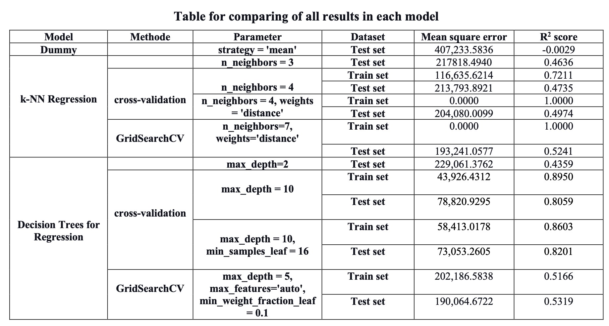

# Exploring Machine Learning

This repository has different machine learning models that work on the same dataset and show how to choose the model's hyperparameters for the best accuracy. The regression and classification problem are in the machince-learning and Daltaton notebook ,respectively.

# machince-learning notebook
This notebook worked with the rental bike dataset to predict the number of rental bikes out for each hour, and the remaining columns are features such as the date, the temperature, the wind speed, the visibility, etc. This problem is suitable for the regression algorithm because the model will predict the output of the continuous variable, which is the rental bike count. 

There were two algorithms performed in this task: 
* k-NN Regression 
* Decision Trees for Regression 

Two different methods were considered to select hyperparameters:
* Cross-validation
* GridSearchCV

Mean square error and $R^2$ were martic to measure performance of algorithms in this problem. In addition, DummyRegressor model was performed as a baseline.

## The result of this project

# Daltaton notebook
This notebook contains the competition data science from the Deltaton. It predicted purchased insurance which is the binary target variable (1: buy, 0:ignor) based on the historical customer insurance data.

This work used KNeighborsClassifier to classify the target and cross-variation to choose the hyperparameter. Moreover, it implemented the Logistic Regression from the scratch.

